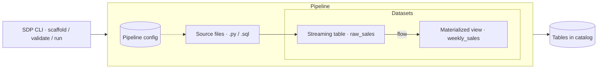

{/* Hero image / thumbnail to be added */}

I have been a fan of Apache Spark and the community behind it for some time now. It is truly remarkable to see what the project has grown into over the years: the journey from Resilient Distributed Datasets (RDDs) to Spark SQL and Structured Streaming, and on to the most recent evolution, Spark Declarative Pipelines (SDP). It is without doubt one of the most transformative and impactful projects in the data engineering world. A search for SDP turns up multiple articles claiming that it could be the catalyst for a step change that transforms the future of data engineering workflows. As someone who is inquisitive by nature, this has sparked (pun intended) my curiosity, sending me down the path to learn more about it: what it unlocks, how it is used in practice, and what it really means for the industry and the Spark ecosystem.

We'll start with a brief discussion on imperative and declarative systems, followed by a deep dive into SDP and the components that make it up, and conclude with a reflection on where this new framework will fit in the modern data stack. The intent here is not to provide an opinionated breakdown of how to optimally structure an SDP project, which will be a subject for the future. This is also not a deep dive into the Spark architecture and its underlying concepts, as that is eloquently covered elsewhere.

## Some Basics

Before we go any further, let us orient on what it means to be declarative in the context of this article.

There are many different programming paradigms, but we'll limit our discussion to the two that are relevant here: imperative and declarative. Imperative, in its purest sense, means you tell a machine what it needs to do by listing a series of steps to get to the desired outcome. Declarative, on the other hand, is simply stating the end state and letting the abstractions under the hood converge to it.

If you have been working in data, you have likely already encountered declarative systems such as SQL, where you define the state of a dataset using DDL or DML statements and let the engine and optimisers under the hood figure out the optimal pathway for execution. Similarly, in the infrastructure world, Terraform lets you define the end state of your infrastructure and has the system handle dependency mapping, state management, and deployments. Given how deeply integrated these systems are in the modern data stack, it is no surprise that their declarative features often go unnoticed. Their simplicity masks the sophistication required to manage datasets at scale in a warehouse, or the ability to seamlessly deploy (or destroy) infrastructure. Naturally, the declarative nature of these systems hides away the details of the implementation, allowing practitioners to focus their efforts on the desired outcome. In practice, this translates to more of the team being equipped with tools that elevate the value of their contributions, effectively creating systems that are scalable, extensible, maintainable, and less error-prone.

```mermaid caption="Imperative specifies the steps; declarative specifies the outcome"
flowchart LR
    subgraph Imperative
        direction LR
        I1(Step 1) --> I2(Step 2) --> I3(Step 3) --> IO(Outcome)
    end
    subgraph Declarative
        direction LR
        DS(Desired state) --> EN{{Engine / optimiser}} --> DR(Outcome)
    end
```

The perks of being declarative are not meant to overshadow the place of imperative systems. In fact, an imperative approach is recommended if you are working on systems that require granular performance optimisations, building bespoke algorithms, and the like. Imperative systems are also great for learning, because they force you to think through the entirety of execution, which over time builds the intuition you need to work on the higher-order abstractions that generally fit into a declarative model.

Taken together, both are valid, but the choice of imperative or declarative depends on the outcome, the envisioned architecture, and team maturity. With that context in place, it's time to dive into the headline.

## Spark's Declarative Turn

Traditionally, Spark has not been declarative. If you have worked with it in the past, you will know that the responsibility is on you to explicitly define the materialization strategy, build and wire up data quality frameworks, handle the order of execution, manage checkpoints, orchestrate retries, build and maintain custom tooling for monitoring and alerting, and more. It is entirely feasible to do all of the above, but as you scale, this mode of operation breaks down, almost becoming the chokepoint for many teams who just want to do productive data engineering work and not be held back by managing custom frameworks and tooling to support their Spark workloads.

Since the early Delta Live Tables (DLT) days, the team at Databricks, also Apache Spark's founding team, has been a great advocate for making Spark more declarative. Though it was generally well received, the proprietary, closed model of DLT meant it was limited to Databricks customers. The learnings and feedback from DLT, however, became the fuel for incorporating those principles into Apache Spark as SDP, improving its general accessibility while also facilitating the rebranding of DLT in Databricks as the new Lakeflow Declarative Pipelines (LDP), which under the hood uses SDP as its primary framework of execution.

## So, What Exactly is SDP?

In a nutshell, and from the docs:

> Spark Declarative Pipelines (SDP) is a declarative framework for building reliable, maintainable, and testable data pipelines on Apache Spark. SDP simplifies ETL development by allowing you to focus on the transformations you want to apply to your data, rather than the mechanics of pipeline execution.

It's a bit of a mouthful, and without context it may not make a lot of sense, so let's break it down by looking at two tables defined using SDP.

```python
from pyspark import pipelines as dp

@dp.table()
def raw_sales():
    return spark.readStream.table("sales.raw_sales")

@dp.materialized_view()
def weekly_sales():
    return (
        spark.read.table("raw_sales")
        .withColumn("week_start", date_trunc("week", col("date")))
        .groupBy("week_start", "store_id")
        .agg(sum("amount").alias("total_sales"))
    )
```

<Callout type="note">

When you work with SDP, you will encounter three different types of materializations:

- **Streaming table** — an unbounded table where each new record is appended as a new row.
- **Materialized view** — computes and persists the query results into a physical table.
- **Temporary view** — a session-scoped virtual table that does not persist results but instead saves a query definition, run against the source table when queried.

</Callout>

In the example shown above, we are using SDP to define two tables: a streaming table (`raw_sales`) and a materialized view (`weekly_sales`). If you prefer SQL, here is the same in SQL:

```sql
CREATE STREAMING TABLE raw_sales
AS SELECT * FROM STREAM sales.raw_sales;

CREATE MATERIALIZED VIEW weekly_sales
AS SELECT
  date_trunc('week', date) AS week_start,
  store_id,
  SUM(amount) AS total_sales
FROM raw_sales
GROUP BY date_trunc('week', date), store_id;
```

None of the above looks new. Vanilla PySpark and Spark SQL can produce both of those tables today, so on the face of it there's little reason to reach for another framework. The difference isn't in what the code does, it's in what the code no longer has to say.

To get the same two tables into production without SDP, you would also write a checkpoint location for the streaming read and manage it across environments, an orchestrator DAG encoding that the weekly sales table runs after the raw sales table, and retry and failure-handling configuration on each task. You would also be on the hook for deciding whether weekly sales is rebuilt or appended and writing the code to enforce it, plus whatever monitoring you have around all of it. None of that is transformation logic. All of it is mechanics that you need to maintain.

In the SDP version, the dependency is declared in a single place — the weekly sales table reads the raw sales table — and that reference is the graph. The pipeline analyses the objects you've defined and works out execution order and parallelisation from them. Materialisation semantics follow from the decorator, and the checkpoint is the framework's problem, not yours.

That is the actual shift: not a new way to express transformations, but the removal of everything you previously had to express around them.

Under the hood, SDP has a few components that make this magic happen, namely datasets, flows, pipelines, and a CLI tool.

### Datasets

A dataset is the object that lands in the database, essentially the physical layer. It can be a streaming table, materialized view, or temporary view (see the supporting notes above). The dataset is defined using a query, either in Python or SQL.

### Flows

A flow defines the semantics of how data is processed into a target dataset. It is generally auto-created, but you do have the option to explicitly define a flow if needed for complex workflows. Depending on the target dataset, the flow determines whether the data is processed incrementally as a stream or via a full refresh of a physical table.

### Pipelines

A pipeline is the unit of development and execution, and it can contain one or more flows. It is a collection of source code files and configuration. The source files (`*.py` or `*.sql`) declare datasets along with the queries and flows that produce them. The execution of a pipeline is managed by a configuration file that specifies how the pipeline runs and where data is stored. With these artefacts in place, the pipeline can infer the dependencies and facilitate the execution of the respective flows as originally intended.

### Tools

SDP also comes with its own CLI to scaffold, validate, and run pipelines locally and in production, which is a handy tool for development and for enforcing SDLC practices.

Putting it all together, here is a representation of an end-to-end SDP:



## Is it Ready for Production?

Yes, but not easily, and there are some known gaps[^1]. This mainly boils down to the fact that it is still early days (it's only been ~6 months since GA). One that stood out to me is that a pipeline defined by SDP today is limited to a single trigger for the whole pipeline, which in practice means you will need to trigger all of the datasets in a pipeline, or end up in a situation where you split pipelines by cadence and not domain. There are also some constraints on what knobs are available for managing retries in SDP. Lastly, SDP does not yet have the more efficient materialized view refresh you get in LDP. I see all of these as teething problems, and in fact some are already on the roadmap for future releases[^2].

[^1]: Spark Declarative Pipelines, going further
[^2]: Spark Declarative Pipelines: Why Data Engineering Needs to Become End-to-End Declarative

As of today, if you are looking to convert your Spark workflows to be declarative, the realistic option is still Databricks. Databricks has had a few years of a head start in this regard and has been refining the product through feedback from teams that are already running thousands of Spark Declarative Pipelines through Databricks Lakeflow. As for SDP, what we have here is the foundation, and I am sure there will be multiple iterations of it in the future that will close the gaps and bring production-ready capabilities to the open-source frontier.

There is an elephant in the room that I have not addressed yet. Something I see a fair bit is the comparison between SDP/LDP and data build tool (dbt). For the sake of a fair comparison, I will not compare SDP and dbt, but LDP is a mature product and a worthwhile contender for dbt if you are already on Databricks, especially now that the underlying framework (SDP) is open sourced. One can draw a parallel between dbt and LDP, but they differ in many respects. dbt is a database-agnostic data transformation tool with strong tooling, community, and adoption. LDP, on the other hand, is relatively new in this space, but it does more than just transformation and is ideal for handling both batch and streaming Spark workloads in both Python and SQL, and is also capable of writing back to a message bus, giving you a tool that can handle end-to-end data engineering. They are both great tools, and depending on a number of factors, including team skillset, you could go one way, the other, or both.

## Conclusion

The most consequential thing about SDP isn't the framework itself, it's that the gap between SDP and LDP is now a capability gap rather than a licensing one. Six months ago, going declarative with Spark meant buying into Databricks. Today it means accepting a less mature implementation of the same engine, and "less mature" is a problem that closes on its own given time and contributors, lowering the risk if you choose to add SDP to your stack.

Practically, that leaves most teams in one of three places. If you're already on Databricks, LDP remains the answer, and SDP changes nothing about your decision except your confidence in its longevity. If you're running Spark elsewhere at scale, the single-trigger constraint alone is prohibitive for now, but it's worth building a non-critical pipeline in SDP to develop the intuition before the constraints lift. And if you're weighing SDP against dbt, that's the wrong comparison; dbt still wins on ergonomics, community, and the sheer weight of existing projects. LDP is the contender there, not SDP, at least not yet.

What Databricks has effectively done is hand the community the substrate of its own commercial product and bet on being better at productising it than anyone else. That's a confident move, and it's the reason SDP is worth watching even if you don't adopt it this year.
